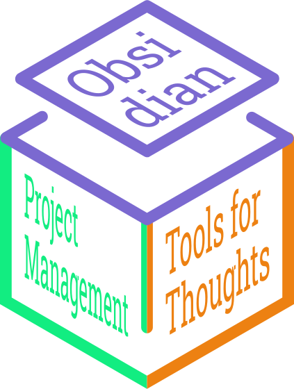

  

Obsidian là một phần mềm ghi chú mới xuất hiện từ năm 2020. Điểm khác biệt của nó với Word hoặc Google Docs là khả năng liên kết các ghi chú lại như Wikipedia mà không bị ràng buộc bởi việc nên phân loại theo thư mục nào. Điểm khác biệt của nó với Notion hoặc Google Docs là nó lưu dữ liệu trên máy bạn chứ không lưu trên máy chủ, khiến cho bạn có sự tự chủ và tự do tuyệt đối với dữ liệu của mình.  

Bất cứ ai trong chúng ta đều có những nhu cầu cần được đáp ứng. Những nhu cầu này chảy qua cơ thể chúng ta, tạo ra những dự định về tương lai trong tâm trí của chúng ta. Khi một dự định trở nên đủ lớn, nó sẽ trở thành một dự án. Khi một dự án trở nên đủ phức tạp, bạn cần những công cụ giúp bạn điều chỉnh kế hoạch theo sự biến động của môi trường cũng như kết nối các nguồn lực mà không tốn quá nhiều năng lượng. Những công cụ cho bạn sự tự chủ và tự do với dữ liệu của mình, không giam hãm thông tin trong những ốc đảo nào sẽ giúp bạn làm được điều đó.
  
Vào khoảnh khắc bạn nhận ra được rằng bạn có thể sử dụng một công cụ nào đó để đạt được một mục tiêu nào đó, bạn đã không còn là chính mình như trước nữa. Lấy những dụng cụ quang học làm ví dụ. Một cái kính lúp sẽ phóng to những chi tiết nhỏ, và một cái kính cận sẽ làm sắc nét những thứ nhoè nhoẹt. Nhưng chúng không chỉ giúp bạn thấy rõ những thứ khó thấy, chúng còn có thể giúp bạn thấy được những điều bất khả thấy. Một chiếc kính viễn vọng sẽ giúp bạn thấy được số vệ tinh của hành tinh Thổ, và một chiếc kính hồng ngoại sẽ giúp bạn thấy được những chuyển động trong đêm. Nhưng nếu ta không lấy làm bất ngờ gì lắm khi nghe tới những loại ánh sáng mắt không thế nhìn ra, thì tại sao ta lại bất ngờ khi biết rằng có những loại suy nghĩ não không thể nghĩ tới? Dù sao thì, cả mắt và cả não đều bị giới hạn trong cái cấu trúc sinh học của nó. Và cũng giống như những công cụ nhìn kia giúp ta nhìn thấy được những thứ khó nhìn và bất khả nhìn, thì với những công cụ nghĩ ta có thể nghĩ tới những suy nghĩ khó nghĩ và bất khả nghĩ. 

Sau khi đọc xong những điều này, hiện có những câu hỏi nào xuất hiện trong đầu bạn?

| Câu hỏi của bạn                                                                               | Loại câu hỏi | Nơi cho câu trả lời           |
| --------------------------------------------------------------------------------------------- | ------------ | ----------------------------- |
| Obsidian có gì hay? Nó giúp ích gì trong việc tư duy, hệ thống kiến thức, hoặc quản lý dự án? | What         | [💎 Giới thiệu về Obsidian](./%E2%9A%94%EF%B8%8F%20H%C6%B0%E1%BB%9Bng%20d%E1%BA%ABn%20Obsidian%20v%C3%A0%20Git/%F0%9F%92%8E%20Gi%E1%BB%9Bi%20thi%E1%BB%87u%20v%E1%BB%81%20Obsidian/index.md) |
| Tôi cần thành thạo thêm những công cụ gì để dự án của tôi được trôi chảy?                     | How          | [📜 Tài nguyên](./%F0%9F%93%9C%20T%C3%A0i%20nguy%C3%AAn/index.md)             |
| Hmm, bản chất của những vấn đề này là gì? Còn những gì tôi không biết là tôi không biết?      | Why          | [⚡Hiểu biết sâu](./%E2%9A%A1Hi%E1%BB%83u%20bi%E1%BA%BFt%20s%C3%A2u/index.md)           |

[Nơi này là nơi nào?](./%F0%9F%93%90%20D%E1%BB%B1%20%C3%A1n/C%20Obsidian,%20qu%E1%BA%A3n%20l%C3%BD%20d%E1%BB%B1%20%C3%A1n%20v%C3%A0%20c%C3%B4ng%20c%E1%BB%A5%20ngh%C4%A9/9%20Blog/N%C6%A1i%20n%C3%A0y%20l%C3%A0%20n%C6%A1i%20n%C3%A0o%EF%BC%9F.md) | [Mọi người hay thảo luận ở đâu?](./%F0%9F%93%90%20D%E1%BB%B1%20%C3%A1n/C%20Obsidian,%20qu%E1%BA%A3n%20l%C3%BD%20d%E1%BB%B1%20%C3%A1n%20v%C3%A0%20c%C3%B4ng%20c%E1%BB%A5%20ngh%C4%A9/9%20Blog/M%E1%BB%8Di%20ng%C6%B0%E1%BB%9Di%20hay%20th%E1%BA%A3o%20lu%E1%BA%ADn%20%E1%BB%9F%20%C4%91%C3%A2u%EF%BC%9F.md) | [Tôi có thể giúp gì?](./%F0%9F%93%90%20D%E1%BB%B1%20%C3%A1n/C%20Obsidian,%20qu%E1%BA%A3n%20l%C3%BD%20d%E1%BB%B1%20%C3%A1n%20v%C3%A0%20c%C3%B4ng%20c%E1%BB%A5%20ngh%C4%A9/9%20Blog/T%C3%B4i%20c%C3%B3%20th%E1%BB%83%20gi%C3%BAp%20g%C3%AC%EF%BC%9F.md) 
